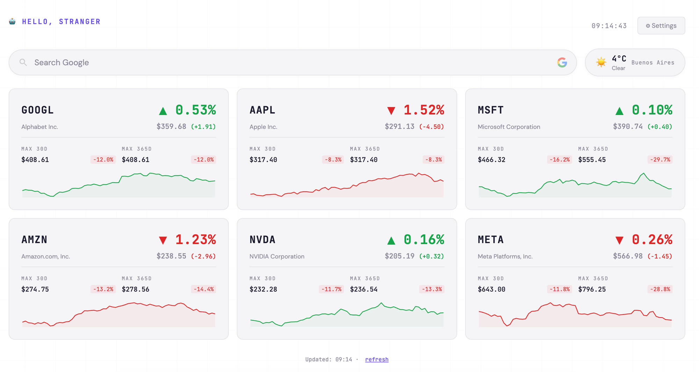
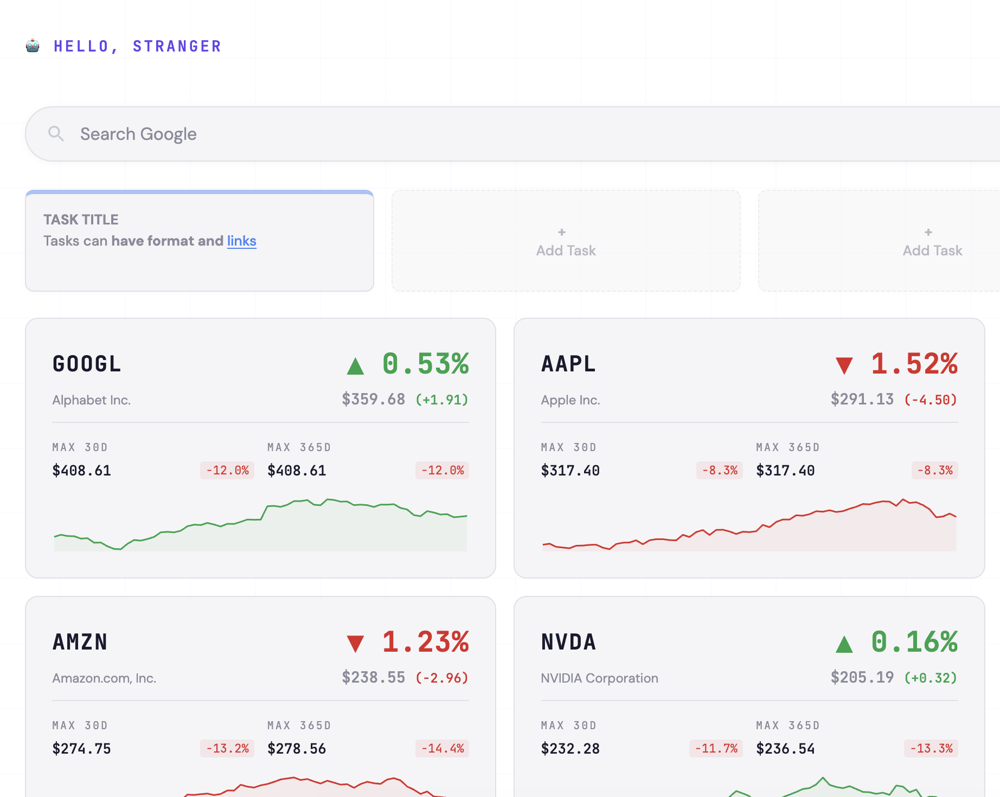
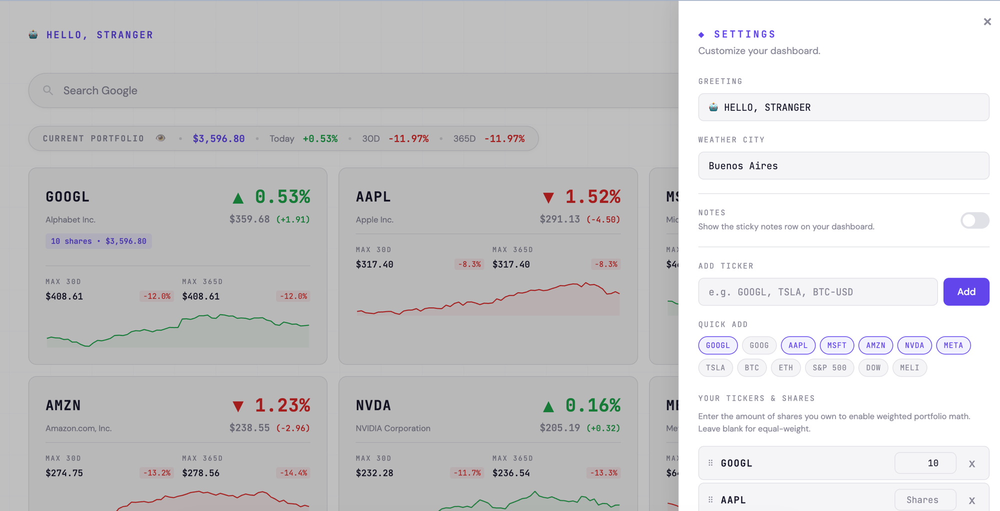

# dashtab

A clean, fast **new tab dashboard** for Chrome. Replaces the default new tab page
with the things you actually want at a glance: live stock prices and portfolio
performance, sticky notes, weather, a clock and a Google search bar.

No accounts, no servers, no tracking — everything lives in your browser.

## Features

- 📈 **Live stocks** — track any ticker (stocks, indices, crypto via Yahoo Finance).
  Each card shows the daily change, a 90-day sparkline, and the 30-day / 365-day highs.
- 💼 **Portfolio summary** — enter how many shares you own and get weighted
  performance for Today, 30D and 365D. The summary bar only appears when you
  actually have holdings, so a price-only watchlist stays clean.
- 👁️ **Privacy mode** — one click hides your total value and holdings (`***`),
  handy when sharing your screen.
- 📝 **Sticky notes** — up to four quick notes with inline editing, drag-to-reorder
  and `Ctrl/Cmd+K` to turn selected text into a link. Off by default; enable it in Settings.
- 🌤️ **Weather** — current conditions for any city (powered by Open-Meteo).
- 🔍 **Search & clock** — Google search bar (auto-focused) and a live 24h clock.
- 💾 **Backup & restore** — export your whole setup to a `.json` file and import it
  back, so updates never wipe your configuration.
- 🔄 **Chrome sync** — your settings follow you across devices via `chrome.storage.sync`.

## Screenshots

**Notes with bold and links** (`Cmd/Ctrl+B` and `Cmd/Ctrl+K`):

**Settings panel:**

## Installation (load unpacked)

dashtab is not on the Chrome Web Store, so you install it manually. This is the
standard "load unpacked" flow for a developer/unpacked extension — it takes about
a minute and works in any Chromium browser (Chrome, Edge, Brave).

1. **Get the code.** Either:
   - Click the green **Code → Download ZIP** button on this page and unzip it, or
   - Clone it: `git clone https://github.com/jmlucero/dashtab.git`
2. Open **`chrome://extensions`** in your browser (paste it in the address bar).
3. Toggle **Developer mode** ON (top-right corner).
4. Click **Load unpacked** and select the **`dashtab` folder** you just downloaded
   (the folder that contains `manifest.json`, not a parent folder).
5. Open a **new tab** — dashtab replaces the default new tab page. Done.

> **Note:** because it's loaded unpacked, the folder must stay where you put it. If
> you move or delete it, Chrome disables the extension.

**To update later:** pull the latest changes (`git pull`) or download the new ZIP
over the old folder, then click the reload (↻) icon on the dashtab card in
`chrome://extensions`.

**To remove it:** click **Remove** on the dashtab card in `chrome://extensions`.

## Usage

- Click **⚙ Settings** (top-right) to add tickers, set your weather city, edit the
  greeting and turn the notes row on or off.
- Use the **Quick add** chips for common tickers, or type any symbol (e.g. `GOOGL`,
  `BTC-USD`, `^GSPC` for the S&P 500).
- Enter **shares** next to a ticker to unlock weighted portfolio math and the
  "Current Portfolio" summary bar. Leave it blank to keep it as a simple watchlist.
- **Notes** (when enabled): click an empty slot to add one, drag to reorder, and
  use **`Cmd/Ctrl+B`** for bold and **`Cmd/Ctrl+K`** to turn selected text into a link.
- The **privacy** toggle (👁️) hides your portfolio value and holdings instantly.
- The notes toggle and privacy toggle save automatically — no need to reload.
- Use **Export / Import Backup** in Settings to save or restore your whole setup.

## Privacy

dashtab has **no backend of its own** and collects nothing. Specifically:

- Your tickers, shares, notes and preferences are stored locally in
  `chrome.storage.sync` (synced by Chrome to your Google account if you have sync on).
- Stock data is requested directly from **Yahoo Finance** (`query1/query2.finance.yahoo.com`).
- Weather data is requested directly from **Open-Meteo** (`open-meteo.com`).
- The only permissions requested are `storage` and host access to those two APIs
  (see [`manifest.json`](manifest.json)).

## How it works

- `newtab.html` + `styles.css` + `app.js` render the dashboard and handle all UI.
- `background.js` is a service worker that fetches stock and weather data — this
  keeps requests off the page and sidesteps CORS restrictions.
- Manifest V3, no build step, no dependencies. Plain HTML/CSS/JS.

## Changelog

See [CHANGELOG.md](CHANGELOG.md) for version history.

## License

[MIT](LICENSE) © jmlucero
